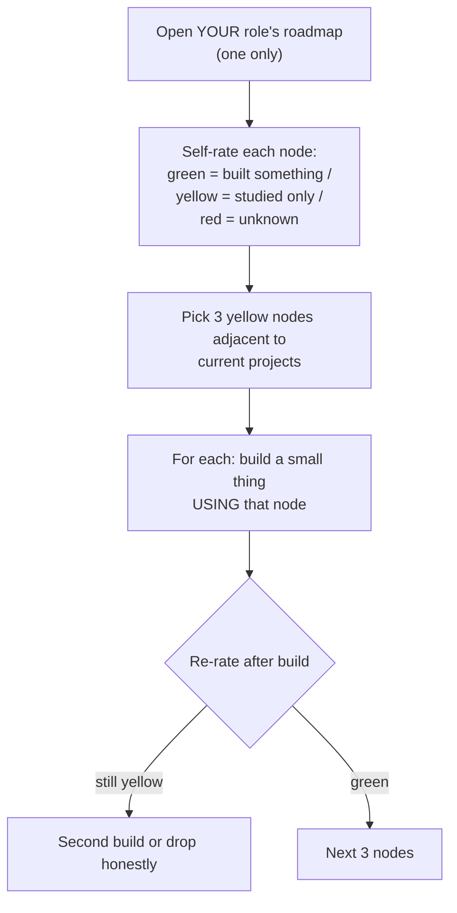

## For future agent
roadmap.sh source repo: the famous visual role roadmaps (Frontend, Backend, DevOps, AI Engineer, Full Stack, Data Analyst…) with click-through detail pages. This page covers its structure, how to use it WITHOUT drowning (the checkbox trap), and integration with this vault's own roadmaps. Fetched attempt failed on raw file (repo uses images/site) — content from well-established knowledge of the project `(confidence: high on structure, TBC on latest 2026 additions)`.

# Developer Roadmap (roadmap.sh) — Expanded

## What It Contains

Interactive visual roadmaps per role: ordered skill-nodes (HTML → CSS → JS → framework → tooling…) where each node links to a detail page (what it is, why needed, resources). Also beginner-friendly versions and yearly updates. Community-translated.

## The Checkbox Trap (its specific failure mode)

The site's progress-tracking invites **node-ticking as the game**. Ticking 80 nodes produces completion-feeling while actual competence stays at whatever you BUILT with those nodes. Mechanism: variable-reward clicking ≈ slot machine.

**Engineered usage**:

**Rule**: you may never tick a node green without an artifact that used it.

## Integration With This Vault

| roadmap.sh role | Vault companion |
|-----------------|-----------------|
| Frontend | [[repo-fullstack-web-developer-path]] + [[web-development-resources]] |
| Backend / DevOps | [[systems-design-distributed]] + [[repo-system-design-primer]] |
| AI Engineer / Data Analyst | [[roadmap-ml-engineer]] / [[roadmap-data-scientist]] |
| All | [[business/careers/market-analysis-tech-2026]] for prioritization |

roadmap.sh answers "WHAT skills exist for this role"; vault roadmaps answer "in what ORDER and HOW with failure-prep". Use both: site for coverage-checks quarterly, vault for execution.

**Premortem**: *"Completed the frontend roadmap"* (ticked everything) but zero deployed sites. Autopsy: ticking replaced building; breadth collected at surface depth. The self-rating protocol above converts the site from game to diagnostic.

## Life Integration

- Quarterly 45-min coverage audit per active role-map
- Node-builds count toward portfolio metrics
- Metrics: green-with-artifact ratio (the only honest number), red→yellow→green transitions per quarter

## Example Checkpoint Questions

1. Of my green nodes, how many have artifacts? (This is your real score.)
2. Which red node blocks my CURRENT project? That one jumps the queue.

## Cross-Vault Links

[[programming/learning-resources/index|Field Index]] · [[roadmaps-and-study-guides]] · [[market-analysis-tech-2026]]