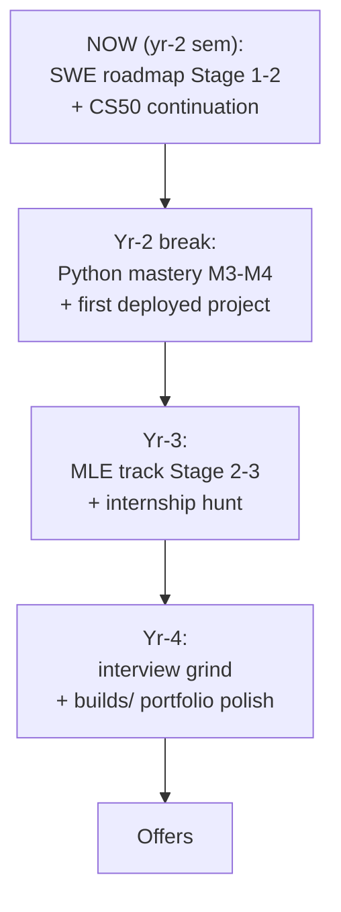

## For future agent
**DOMAIN SCOPE**: "Show me my roadmaps" / "what's my plan for X" → THIS page is the single entry. Roadmap pages physically live inside their domain folders (pages not moved); this hub links all of them plus the meta-catalogs. Update this list whenever a new roadmap page is created anywhere.

# Roadmaps — Master Hub

## Career Track Roadmaps (deep, stage-gated)

| Roadmap | Domain | Stage Gates |
|---------|--------|-------------|
| [[roadmap-software-engineer]] | programming/ | 6 stages: language → CS core → DS&A → systems → portfolio → interview grind |
| [[roadmap-data-scientist]] | ai-data/ | Python-data → SQL → math spine → classical ML → storytelling → interviews |
| [[roadmap-ml-engineer]] | ai-data/ | Foundations → DL one-framework → MLOps → GenAI/CV branch |
| [[repo-data-engineer-roadmap]] | ai-data/ | SQL → warehouse → Spark/Kafka → Airflow → cloud |

## Meta-Catalogs (pick-a-path layer)

- [[roadmaps-and-study-guides]] (business/) — all major external roadmaps compared
- [[lr-developer-roadmap]] (learning-resources/) — roadmap.sh visual maps + anti-checkbox protocol
- [[repo-ossu-computer-science]] · [[repo-ossu-data-science]] — full free-degree curricula
- [[repo-teachyourselfcs]] — 9-subject canon

## Course & Exam Roadmaps (field-specific)

- [[ml-theory-and-moocs]] — ML course catalog w/ selection logic (ai-data)
- [[repo-mlcourse-ai]] — 12-week mlcourse schedule (ai-data)
- [[python-mastery-path]] · [[math-for-ml-survival-guide]] — skill ladders (programming/ai-data)
- [[quant-finance/learning-roadmap-and-study-plan]] — quant self-study plan (business)
- [[german/overview]] — German A1 8-week plan (self-dev)
- [[modules/engineering/index]] style college gates → see [[engineering/INDEX]]

## The Combined Master Sequence (suggestion)

Full reasoning: [[market-analysis-tech-2026]] strategy section.

## Maintenance Rule

New roadmap page created anywhere in the vault → add its link here. This hub is the ONE place to answer "what's the plan".

## Related

[[market-analysis-tech-2026]] · [[how-to-self-teach]] · [[North Star]]