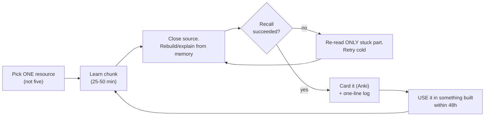
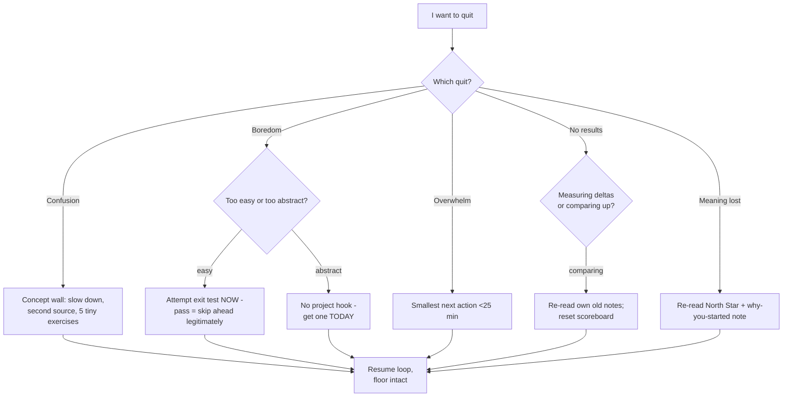

## For future agent
THE master learning methodology — deep edition. Every roadmap and playbook in the vault references this page instead of repeating psychology. Adds: mechanism-level analysis of the three failure engines (dopamine mis-prediction, identity-verification loops, environment friction), the full quit-point map with physiological early warnings, premortem of a failed learning year, defeat-tackling master flowchart, Anki engineering rules, energy-vs-time scheduling R&D, and life integration as a weekly operating system.

# How to Self-Teach Anything — Deep Edition

## Part 1 — Why Self-Taught People Fail (the three failure engines)

Failure is not intelligence; it's predictable system dynamics:

### Engine 1: Dopamine Mis-Prediction
Tutorials deliver novelty-rewards on a 2-minute cycle (new concept! new demo!). Building delivers reward on a multi-day cycle (it finally works). The brain, trained on fast cycles, experiences building as *punishment* relative to watching. **You are not lazy; you are withdrawal-symptomatic.**
→ Counter: the 1:1 build rule isn't discipline theater — it's re-calibrating reward cycles by forced exposure until builds start delivering their own (deeper) rewards.

### Engine 2: Identity-Verification Loop
"I am someone who is learning X" feels satisfying *independent of progress*. The identity pays out daily while the skill compounds slowly — so the identity consumes the motivation that was supposed to fund the skill.
→ Counter: identity tied to BEHAVIOR ("I am someone who ships something every Friday"), not to state ("I am a learner"). Behavior-verifiable identities can't be cashed dishonestly.

### Engine 3: Environment Friction
Every step between intention and action (find notebook → open IDE → remember where files were) taxes a finite willpool. High-friction environments make quitting the default path of least resistance.
→ Counter: friction inversion — project open in browser tab, desk pre-set night before, phone in another room during anchor slot. Make starting easier than not-starting.

## Part 2 — The Learning Loop (mechanism-corrected)

**Why each element exists**:
- **Retrieval (step C)**: memory strengthens on successful *retrieval attempts*, not exposure — re-reading creates fluency illusion
- **48h build (step G)**: converts recognition into recall under realistic constraints; forces edge cases tutorials hide
- **ONE resource (step A)**: course-hopping is Engine-1 behavior disguised as diligence

## Part 3 — Non-Negotiable Rules

1. **One primary resource per subject** — finish or formally drop (write the drop decision down)
2. **1:1 build rule** — tutorial hour = build hour
3. **Never-zero floor** — define your bad-day minimum NOW (e.g., 2 flashcards + 15 min). Streak survives; identity survives
4. **Public log** — daily note; written progress is visible progress
5. **Exit criteria before starting** — what does "done" mean? No exit test = infinite drift
6. **Friction audit monthly** — what's between "I should" and "I'm doing"? Remove one item

## Part 4 — Spaced Repetition Engineering

Anki works only when engineered:

| Rule | Why |
|------|-----|
| Card only what YOU failed to recall | Pre-made decks encode someone else's gaps |
| One fact per card | Retrieval strength decays with card complexity |
| Your own phrasing | Generation effect doubles encoding |
| Daily review inside never-zero floor | Streak protection > volume |
| Delete/edit bad cards ruthlessly | Bad cards train wrong associations |

Starters: system-design-primer + CIU ship decks; prune to your misses.

## Part 5 — The Quit-Point Map (with early warnings)

| Stage | Timeline | Quit Trigger | Real Mechanism | Physiological Warning | Recovery Protocol |
|-------|----------|--------------|----------------|----------------------|-------------------|
| Honeymoon | Day 1–14 | Life interrupts | Motivation was sole fuel; no system underneath | Sessions depend on "feeling like it" | Install schedule + floor retroactively |
| First wall | Week 3–6 | First hard concept | Walls ARE the curriculum; brain flags difficulty as error | Avoidance behaviors (cleaning, "research") | Slow 50%, second source, 5 tiny versions |
| Tutorial hangover | Month 2–3 | "Watched everything, can't BUILD" | Recognition ≠ recall; engine 1 dominance | Video-hours ≫ build-hours | 2 weeks input-fast: docs-only building |
| Plateau of despair | Month 3–6 | Comparing to years-ahead strangers | Wrong scoreboard (others' highlight reel vs your raw log) | Scroll sessions replacing study | Re-read month-1 notes; measure deltas |
| Job-market panic | Anytime | Layoff/hiring headlines | External locus hijack; engine 2 identity wobble | Doomscroll sessions | [[business/careers/market-analysis-tech-2026]] facts-over-vibes |
| Project paralysis | Ongoing | Project too big, done undefined | Scope, not skill | Open editor, no first line | Cut scope 70%; v0.1 sentence ([[business/careers/build-project-playbook]]) |

## Part 6 — Full Premortem (failed learning year)

*December: the year produced nothing durable.* Ranked findings:

1. **Three courses started, zero finished** (Engine 1 + switching)
2. **Daily notes have consumption entries only** — no build logs (recognition trap)
3. **Anki deck created twice, reviewed twice** — no floor anchoring
4. **Two projects at 30%** — v0.1 sentences never written
5. **December self can't do what March self could** — no spaced retrieval, everything decayed

Each finding has an earlier counter. Monthly review question: *"Which numbered finding would December-me write about THIS month?"*

## Part 7 — Energy-vs-Time Scheduling (R&D)

Time-blocks fail because they assume flat cognitive capacity. Reality:

| Energy State | Best Use | Worst Use |
|--------------|----------|-----------|
| Peak (usually morning) | New hard concepts; debugging walls | Email, videos, admin |
| Mid | Exercises, flashcards, writing | New abstract material |
| Low | Anki reviews, reading logs, organizing | Anything requiring invention |

**Protocol**: map YOUR daily energy curve for one week (rate 1–5 every 3h). Place stage-core work at your personal peak; protect it from college's worst slots. Never-zero uses low states — by design.

## Part 8 — Life Integration (weekly operating system)

| Day | System Component |
|-----|------------------|
| Mon–Fri | Anchor slot (peak energy) + floor maintenance + friction check nightly |
| Sat | Extended block (90m) on current exit-test gap |
| Sun | Weekly review (30m): premortem scan · metrics · plan · ONE improvement to the system itself |

**Metrics reviewed Sundays**: build:consume ratio ≥1 · streak days · exit-tests passed · cards due-completion % · defeats logged with fixes (a healthy week logs 2–3 defeats — zero logged means zero attempted).

## Example Checkpoint Questions (monthly honesty)

1. Which failure engine ran my last two weeks?
2. What did I BUILD this month that I can show without context?
3. Where exactly is my friction point — and what single change removes it?

## Cross-Vault Links

[[roadmap-software-engineer]] · [[roadmap-data-scientist]] · [[roadmap-ml-engineer]] · [[self-dev/productivity/atomic-habits-systems]] · [[self-dev/productivity/deep-work-attention-economics]] · [[business/careers/build-project-playbook]] · [[Patterns]]